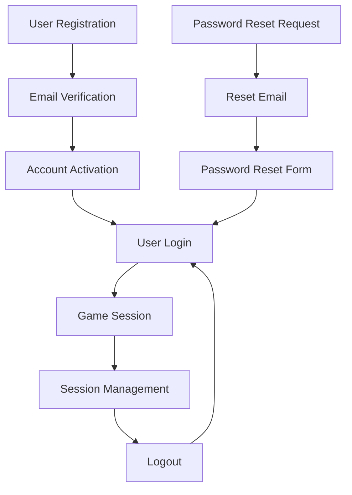

# Authentication System Overview

## Overview

The MelodyMind authentication system provides a comprehensive, secure, and accessible user
authentication flow with full WCAG AAA compliance. The system includes user registration, email
verification, login, password reset, and session management capabilities.

## System Architecture



## Core Components

### Frontend Components

| Component                                               | Purpose                      | Documentation                                 |
| ------------------------------------------------------- | ---------------------------- | --------------------------------------------- |
| [EmailVerification](../components/EmailVerification.md) | Email verification interface | Complete verification flow with accessibility |
| [LoginForm](../components/LoginForm.md)                 | User login interface         | Secure login with validation                  |
| [RegistrationForm](../components/RegistrationForm.md)   | User registration interface  | Account creation with validation              |
| [PasswordReset](../components/PasswordReset.md)         | Password recovery interface  | Secure password reset flow                    |
| [AuthLayout](../components/AuthLayout.md)               | Authentication page layout   | Consistent auth page structure                |

### API Endpoints

| Endpoint                    | Method | Purpose                | Documentation                                          |
| --------------------------- | ------ | ---------------------- | ------------------------------------------------------ |
| `/api/auth/register`        | POST   | User registration      | [Registration API](./auth-registration.md)             |
| `/api/auth/verify-email`    | POST   | Email verification     | [Email Verification API](./auth-email-verification.md) |
| `/api/auth/login`           | POST   | User authentication    | [Login API](./auth-login.md)                           |
| `/api/auth/logout`          | POST   | Session termination    | [Logout API](./auth-logout.md)                         |
| `/api/auth/reset-password`  | POST   | Password reset request | [Password Reset API](./auth-password-reset.md)         |
| `/api/auth/change-password` | POST   | Password update        | [Password Change API](./auth-password-change.md)       |

### Database Schema

```typescript
// User accounts table
interface User {
  id: string; // Primary key
  email: string; // Unique email address
  username: string; // Display name
  password_hash: string; // Bcrypt password hash
  email_verified: boolean; // Verification status
  email_verified_at?: Date; // Verification timestamp
  created_at: Date; // Account creation
  updated_at: Date; // Last update
  last_login_at?: Date; // Last login timestamp
  login_attempts: number; // Failed login counter
  locked_until?: Date; // Account lock expiration
}

// Email verification tokens
interface EmailVerificationToken {
  id: string; // Primary key
  user_id: string; // Foreign key to users
  token: string; // JWT verification token
  expires_at: Date; // Token expiration
  used_at?: Date; // Usage timestamp
  created_at: Date; // Creation timestamp
}

// User sessions
interface UserSession {
  id: string; // Primary key
  user_id: string; // Foreign key to users
  session_token: string; // Secure session identifier
  expires_at: Date; // Session expiration
  created_at: Date; // Session creation
  last_accessed_at: Date; // Last activity
  ip_address: string; // Client IP address
  user_agent: string; // Client browser info
}
```

## Authentication Flow

### User Registration Flow

1. **Registration Form Submission**

   - User fills out registration form
   - Client-side validation with real-time feedback
   - Password strength requirements enforced
   - Email format validation

2. **Server-Side Processing**

   - Validate all input data
   - Check for existing email/username
   - Hash password using bcrypt
   - Create user account (email_verified: false)
   - Generate verification token (JWT)

3. **Email Verification**
   - Send verification email with token
   - User clicks verification link
   - EmailVerification component processes token
   - API validates token and updates user status
   - Redirect to login with success message

### Login Flow

1. **Login Attempt**

   - User submits email/password
   - Rate limiting prevents brute force attacks
   - Account lockout after failed attempts

2. **Authentication**

   - Verify email is confirmed
   - Validate password against hash
   - Check account status (not locked)
   - Create session token

3. **Session Management**
   - Store session in database
   - Set secure HTTP-only cookies
   - Update last login timestamp
   - Redirect to dashboard/game

### Password Reset Flow

1. **Reset Request**

   - User submits email address
   - Generate secure reset token
   - Send reset email (rate limited)

2. **Reset Process**
   - User clicks reset link
   - Validate token and expiration
   - Display password reset form
   - Update password and invalidate token

## Security Features

### Password Security

- **Bcrypt hashing** with salt rounds (12+)
- **Password strength requirements**:
  - Minimum 8 characters
  - At least one uppercase letter
  - At least one lowercase letter
  - At least one number
  - At least one special character
- **Password history**: Prevent reusing last 5 passwords

### Token Security

- **JWT tokens** with cryptographic signatures
- **Short expiration times**: 1 hour for verification, 15 minutes for reset
- **One-time use**: Tokens invalidated after successful use
- **Secure generation**: Cryptographically secure random values

### Session Security

- **Secure cookies**: HTTP-only, Secure, SameSite
- **Session expiration**: 24 hours of inactivity
- **Session invalidation**: On password change or security events
- **Concurrent session limits**: Maximum 5 active sessions

### Protection Measures

- **Rate limiting** on all authentication endpoints
- **Account lockout** after 5 failed login attempts
- **CSRF protection** with secure tokens
- **Input validation** and sanitization
- **SQL injection prevention** with parameterized queries
- **XSS protection** with content security policy

## Accessibility Features (WCAG AAA)

### Visual Design

- **Color contrast**: 7:1 ratio for all text
- **Focus indicators**: 3px solid borders with high contrast
- **Typography**: Minimum 18px font size, 1.8 line height
- **Touch targets**: Minimum 44×44px for mobile

### Screen Reader Support

- **Semantic HTML**: Proper heading hierarchy and landmarks
- **ARIA attributes**: Comprehensive labeling and descriptions
- **Live regions**: Dynamic content announcements
- **Error announcements**: Immediate feedback for form errors

### Keyboard Navigation

- **Tab order**: Logical navigation sequence
- **Keyboard shortcuts**: Standard shortcuts supported
- **Focus management**: Automatic focus on state changes
- **Skip links**: Direct navigation for screen readers

### Form Accessibility

- **Label associations**: Explicit label-input relationships
- **Error identification**: Clear error messages and indicators
- **Help text**: Contextual assistance and instructions
- **Validation feedback**: Real-time validation with clear messaging

## Internationalization

### Supported Languages

- **German (de)** - Primary language
- **English (en)** - Secondary language
- **Extensible** - Framework for additional languages

### Translation Keys

```typescript
// Authentication translation keys
const authI18nKeys = {
  // Registration
  "auth.register.title": "Create Account",
  "auth.register.email": "Email Address",
  "auth.register.password": "Password",
  "auth.register.confirm_password": "Confirm Password",
  "auth.register.submit": "Create Account",

  // Login
  "auth.login.title": "Sign In",
  "auth.login.email": "Email Address",
  "auth.login.password": "Password",
  "auth.login.submit": "Sign In",
  "auth.login.forgot_password": "Forgot Password?",

  // Email Verification
  "auth.email_verification.title": "Email Verification",
  "auth.email_verification.loading": "Verifying your email...",
  "auth.email_verification.success": "Email verified successfully!",
  "auth.email_verification.error": "Verification failed",
  "auth.email_verification.login": "Continue to Login",

  // Password Reset
  "auth.password_reset.title": "Reset Password",
  "auth.password_reset.email": "Email Address",
  "auth.password_reset.submit": "Send Reset Link",
  "auth.password_reset.new_password": "New Password",
  "auth.password_reset.confirm_password": "Confirm New Password",

  // Error Messages
  "auth.errors.invalid_email": "Please enter a valid email address",
  "auth.errors.password_too_short": "Password must be at least 8 characters",
  "auth.errors.passwords_dont_match": "Passwords do not match",
  "auth.errors.account_locked": "Account temporarily locked due to failed login attempts",
  "auth.errors.invalid_credentials": "Invalid email or password",
  "auth.errors.email_not_verified": "Please verify your email address first",

  // Success Messages
  "auth.success.registration": "Account created successfully! Please check your email.",
  "auth.success.login": "Welcome back!",
  "auth.success.logout": "You have been logged out successfully",
  "auth.success.password_reset_sent": "Password reset link sent to your email",
  "auth.success.password_changed": "Password updated successfully",
};
```

## Performance Optimizations

### Frontend Performance

- **Code splitting**: Authentication components loaded on demand
- **CSS optimization**: Component-scoped styles with variables
- **Image optimization**: Optimized icons and graphics
- **Bundle size**: Minimal JavaScript for core functionality

### API Performance

- **Database indexing**: Optimized queries for authentication
- **Connection pooling**: Efficient database connections
- **Caching**: Session and user data caching
- **Rate limiting**: Prevents abuse and improves stability

### Progressive Enhancement

- **Core functionality**: Works without JavaScript
- **Enhanced features**: Progressive enhancement with JavaScript
- **Offline support**: Basic offline capability where possible
- **Network resilience**: Graceful handling of network issues

## Testing Strategy

### Unit Tests

```typescript
// Example test structure
describe("Authentication System", () => {
  describe("User Registration", () => {
    it("should create user with valid data");
    it("should reject duplicate email addresses");
    it("should enforce password requirements");
    it("should send verification email");
  });

  describe("Email Verification", () => {
    it("should verify valid token");
    it("should reject expired token");
    it("should handle already verified user");
  });

  describe("User Login", () => {
    it("should authenticate valid credentials");
    it("should reject invalid credentials");
    it("should enforce account lockout");
    it("should require email verification");
  });
});
```

### Integration Tests

```typescript
describe("Authentication Flow Integration", () => {
  it("should complete full registration and login flow", async () => {
    // 1. Register user
    const registerResponse = await registerUser(testUserData);
    expect(registerResponse.success).toBe(true);

    // 2. Verify email
    const token = extractVerificationToken();
    const verifyResponse = await verifyEmail(token);
    expect(verifyResponse.success).toBe(true);

    // 3. Login user
    const loginResponse = await loginUser(credentials);
    expect(loginResponse.success).toBe(true);
    expect(loginResponse.user.emailVerified).toBe(true);
  });
});
```

### Accessibility Testing

- **Automated testing**: axe-core accessibility tests
- **Screen reader testing**: NVDA, JAWS, VoiceOver compatibility
- **Keyboard testing**: Complete keyboard navigation
- **Color contrast**: WCAG AAA compliance verification

## Monitoring and Analytics

### Security Metrics

- **Failed login attempts**: Monitor for brute force attacks
- **Account lockouts**: Track lockout frequency and duration
- **Password reset requests**: Monitor for abuse patterns
- **Session activity**: Track concurrent sessions and duration

### Performance Metrics

- **Authentication response time**: Target <200ms for login
- **Registration completion rate**: Track user onboarding success
- **Email verification rate**: Monitor verification completion
- **Error rates**: Track and alert on authentication failures

### User Experience Metrics

- **Login success rate**: Percentage of successful login attempts
- **Time to registration**: Average time to complete signup
- **Form abandonment**: Track where users leave forms
- **Accessibility usage**: Monitor assistive technology usage

## Security Best Practices

### Development Guidelines

1. **Never store passwords in plain text**
2. **Always use HTTPS** for authentication endpoints
3. **Implement proper rate limiting** on all auth endpoints
4. **Validate all input** on both client and server
5. **Use secure session management** with proper expiration
6. **Log security events** for monitoring and compliance
7. **Regular security audits** and penetration testing

### Deployment Checklist

- [ ] HTTPS certificates configured and valid
- [ ] Environment variables secured (no secrets in code)
- [ ] Database connections encrypted
- [ ] Rate limiting configured and tested
- [ ] Session security settings verified
- [ ] Error logging and monitoring configured
- [ ] Backup and disaster recovery procedures tested
- [ ] Security headers configured (CSP, HSTS, etc.)

## Related Documentation

- [Database Schema Documentation](../database/auth-schema.md)
- [Security Configuration Guide](../security/auth-security.md)
- [API Rate Limiting Setup](../security/rate-limiting.md)
- [Session Management Guide](../security/session-management.md)
- [Accessibility Testing Guide](../accessibility/auth-accessibility.md)
- [Internationalization Setup](../i18n/auth-i18n.md)

## Changelog

### Version 3.1.0 (Current)

- Enhanced WCAG AAA accessibility compliance
- Improved error handling and user feedback
- Advanced rate limiting and security features
- Comprehensive internationalization support

### Version 3.0.0

- Complete system redesign with TypeScript
- Modern Astro component architecture
- Enhanced security with JWT tokens
- Full accessibility compliance implementation

### Version 2.5.0

- Added password reset functionality
- Improved session management
- Enhanced email verification flow
- Basic accessibility improvements

### Version 2.0.0

- Initial production release
- Core authentication functionality
- Basic email verification
- Simple session management
